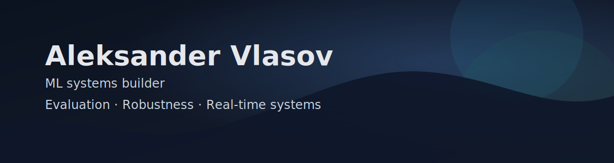

# Aleksander Vlasov

ML systems builder working on real-time evaluation, forecasting, and robustness under distribution shift.

RU / EN / ES

I build technical artifacts around:

- agent evaluation;
- safety under distribution shift;
- Android trust-state measurement;
- repo-context tooling;
- real-time ML systems.

The focus is not demo projects. I care more about runnable artifacts, reproducibility, failure modes, measurable tradeoffs, and systems that can be inspected instead of only described.

## Projects

### Tool-Agent Shift Benchmark

Deterministic benchmark for evaluating tool-using agents under synthetic environment shift.

### streaming-agent-safety-evals

No-training benchmark for evaluating unsafe overconfidence and intervention behavior under dynamic or streaming-like conditions.

### Android Trust Lab

Defensive Android trust-state measurement framework.

### RepoForge

Local-first VS Code extension for building structured repository context packs for coding agents.

### Polinash

Private applied ML systems project focused on forecasting, real-time alerts, and ML infrastructure.

## Direction

The common thread across these projects is reliability under messy conditions:

- distribution shift;
- unsafe overconfidence;
- trust boundaries;
- noisy real-time systems;
- evaluator validity;
- reproducibility;
- context quality for coding agents.

My main strength is turning ambiguous technical problems into runnable artifacts with tests, generated outputs, and clearly stated limitations.
